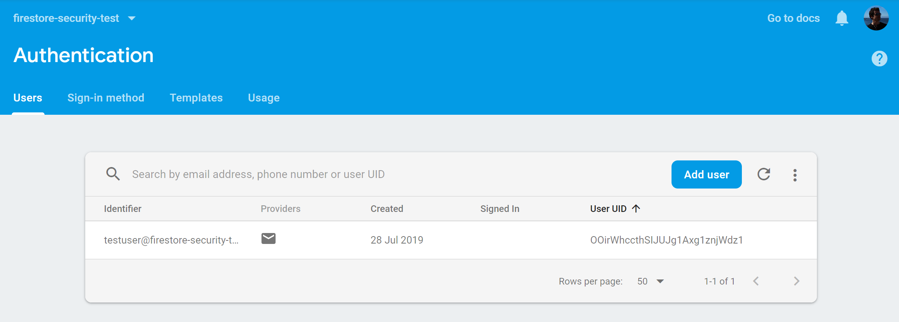
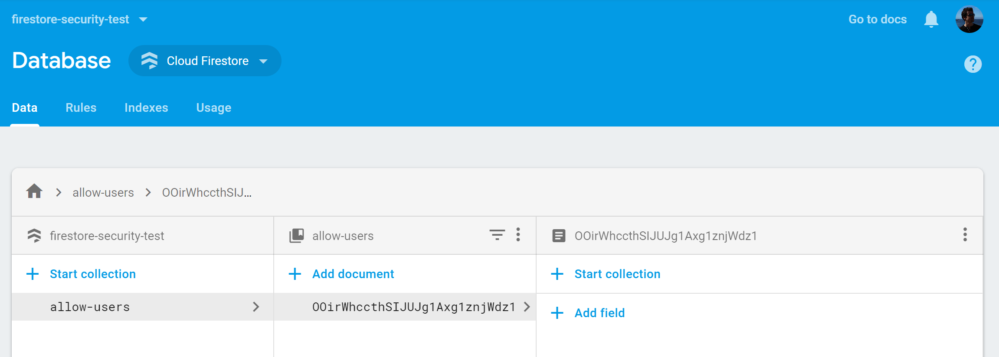
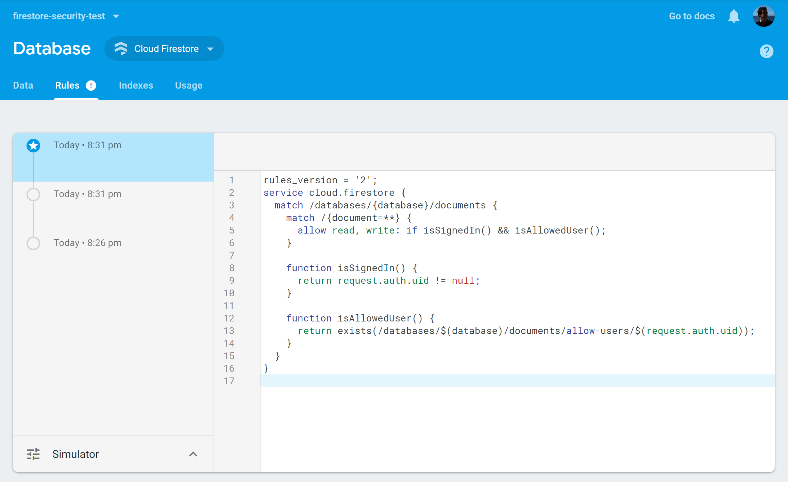

I've been building a few apps recently that leverage [Cloud Firestore] for data storage. These are personal apps and don't store anything particularly sensitive, though that is no reason to leave them in the default development configuration that let's anyone read/write everything.

Although in many projects I'm the only user, there are handful of others where a few people are using the app. A fairly flexible configuration approach that I use as my default is to only allow access if the user is in an 'allow list'.

I'll show the steps needed to do this below, the pre-requisites are:

- Cloud Firestore enabled for the project
- Authentication configured for the project with at least one user authenticated
  - Every user you want to grant access will need to authenticate with the project as we're using their firebase User UID, which is unique to each project

## Implementing an allow list in Firestore

To make this work we're going to create a security rule which will allow users to read/write any part of the database only if they exist in a specific collection, which we will manually populate.

To get started you'll need the User UID of a user who has previously authenticated with the project. In the example below I'm using testuser.



Create a new collection called `allow-users` and for the first document specify the User UID as the document ID. No need to add any fields (though I've found adding a friendly name to remember what the UIDs map to is helpful).



Now configure your Firestore security rules. If you're using the [Firebase CLI] you would deploy these using a `firebase.rules` file, or you can paste into the console and publish.

```javascript
// firestore.rules
rules_version = '2';
service cloud.firestore {
  match /databases/{database}/documents {
    match /{document=**} {
      allow read, write: if isSignedIn() && isAllowedUser();
    }

    function isSignedIn() {
      return request.auth.uid != null;
    }

    function isAllowedUser() {
      return exists(/databases/$(database)/documents/allow-users/$(request.auth.uid));
    }
  }
}
```



From here you can either add additional users to the allow list, or if it's a personal project you're done!

Some things to keep in mind:

- There is no longer any unauthenticated access possible to Firestore - if you need Firestore data to render your app/login this won't work
- Everyone who can access the app gets full access to everything - read and write

## References and further reading

- [Cloud Firestore]
- [Firebase CLI]
- [Cloud Firestore security rules]

[cloud firestore security rules]: https://firebase.google.com/docs/firestore/security/get-started
[cloud firestore]: https://firebase.google.com/docs/firestore/
[firebase cli]: https://www.npmjs.com/package/firebase-tools
