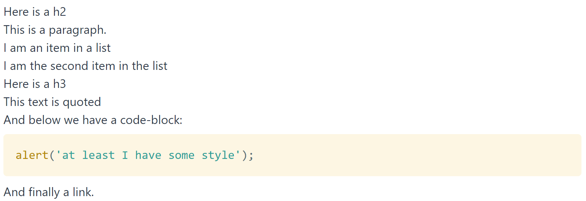
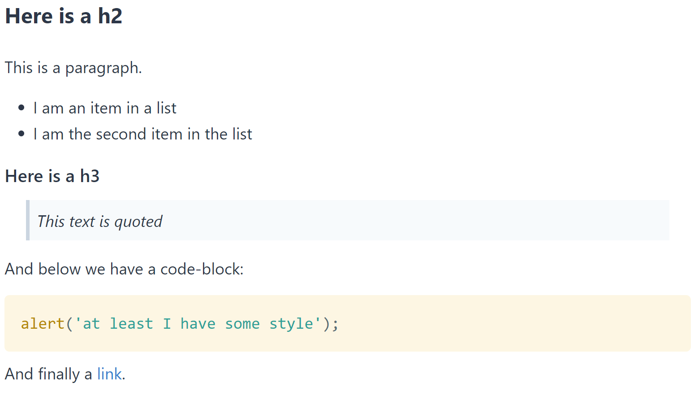

I'm slowly working on migrating the blog from [Jekyll] to [GatsbyJS]. I've decided to use [Tailwind CSS] to style the blog, which means that out of the box (once Tailwind's pretty [aggressive reset][tailwind preflight] has been applied) all the markdown posts end up being unstyled. In the below example the only styling on any element comes courtesy of the [gatsby-remark-prismjs] package, which handles code styling.



After adding some styling to the `site.css` file we're able to get the post looking halfway decent.



I wanted to keep the Tailwind reset applied to the non-markdown parts of the site, so the blog template renders each post into a `div` with the `markdown` class, and the `site.css` is updated to include the below definitions. I'm using [Purge CSS] to strip unused classes, and because these classes aren't directly used anywhere (e.g. `className="..."`) we need to tell Purge CSS to ignore them.

> PurgeCSS only runs in production builds (`gatsby build`) - make sure you test the look & feel of your site after doing a production build, or you might be surprised after you deploy...

```css
/* purgecss start ignore */
/* Markdown Styles */
/* Global */
.markdown {
  @apply leading-relaxed text-lg;
}
/* Headers */
.markdown h1,
.markdown h2 {
  @apply text-2xl my-6 font-bold;
}
.markdown h3,
.markdown h4,
.markdown h5,
.markdown h6 {
  @apply text-xl my-3 font-semibold;
}
/* Links */
.markdown a {
  @apply text-blue-600;
}
.markdown a:hover {
  @apply underline;
}
/* Paragraph */
.markdown p {
  @apply mb-4;
}
/* Lists */
.markdown ul,
.markdown ol {
  @apply mb-4 ml-8;
}
.markdown li > p,
.markdown li > ul,
.markdown li > ol {
  @apply mb-0;
}
.markdown ol {
  @apply list-decimal;
}
.markdown ul {
  @apply list-disc;
}
/* Blockquotes */
.markdown blockquote {
  @apply p-0 p-2 mx-6 bg-gray-100 mb-4 border-l-4 border-gray-400 italic;
}
.markdown blockquote > p {
  @apply mb-0;
}
/* purgecss end ignore */
```

This is a pretty workable solution for most of my posts, though there are still a few areas I'd like to improve (notably padding for images, and the appearance at a few breakpoints isn't ideal).

### Further Reading

The following posts were incredibly helpful in getting Gatsby and Tailwind configured:

- [Install Gatsby with Tailwind CSS and PurgeCSS from Scratch]
- [Using Tailwind with Gatsby]

If you do decide to take the plunge with Tailwind I strongly suggest you read through [what the preflight does][tailwind preflight], as it really does reset things!

[jekyll]: https://jekyllrb.com/
[gatsbyjs]: https://www.gatsbyjs.org/
[tailwind css]: https://tailwindcss.com
[tailwind preflight]: https://tailwindcss.com/docs/preflight/
[gatsby-remark-prismjs]: https://github.com/gatsbyjs/gatsby/tree/master/packages/gatsby-remark-prismjs
[purge css]: https://www.purgecss.com/
[install gatsby with tailwind css and purgecss from scratch]: https://ericbusch.net/install-gatsby-with-tailwind-css-and-purgecss-from-scratch
[using tailwind with gatsby]: https://www.jerriepelser.com/blog/using-tailwind-with-gatsby/
